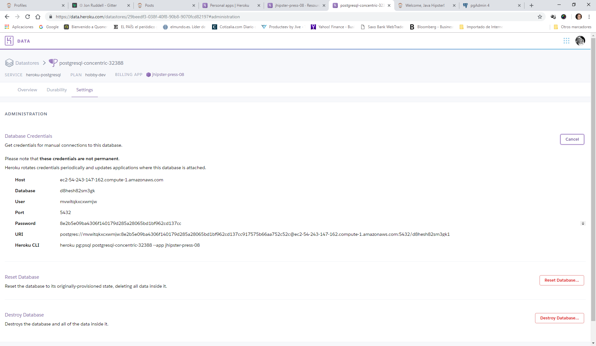
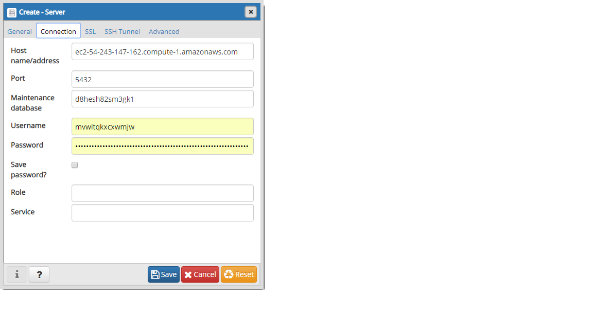

# 如何將PGAdmin（PostgreSQL）連線到Heroku

__送出者 [@Tonterias](https://github.com/Tonterias)__

可能您需要使用PGAdmin將測試資料載入到Heroku資料庫中。

請按照下列步驟操作：

首先，使用Heroku帳戶中的資料庫憑據中的資料填寫建立新服務器PGAdmin表單：
First, use the data from your Database Credentials at your Heroku Account to fill the Create a New Server PGAdmin's form:

然後，您必須在application-prod.yml中設定該訊息：

/src/main/resources/config/application-prod.yml

    spring:
        devtools:
            restart:
                enabled: false
            livereload:
                enabled: false
        datasource:
            type: com.zaxxer.hikari.HikariDataSource
            url: jdbc:postgresql://@ec2-50-17-250-38.compute-1.amazonaws.com:5432/d5u8osf3cgtlg
            username: seejtnnivrl???
            password: e9ed17c73da7ec36bf6eead010968106439debe16ed3df9039be0a9aef??????
            hikari:
                auto-commit: false

您將從Heroku帳戶的資料庫憑據中獲取資料（如另一個範例所示）：

    Host : ec2-50-17-250-38.compute-1.amazonaws.com
    Database : d5u8osf3cgtlg
    User : seejtnnivrlcdw
    Port : 5432
    Password : e9ed17c73da7ec36bf6eead010968106439debe16ed3df9039be?????
    URI : postgres://seejtnnivrlcdw:e9ed17c73da7ec36bf6eead010968106439debe16ed3df9039b???????
    @ec2-50-17-250-38.compute-1.amazonaws.com:5432/d5u8osf3cgtlg
    Heroku CLI : heroku pg:psql postgresql-trapezoidal-20780 --app jhipster-press-08

您只需要連線到資料庫並在PGAdmin查詢視窗中使用sql指令對其進行測試。

注意：以下影片顯示了此過程: https://www.youtube.com/watch?v=GAHsl0AfK-0